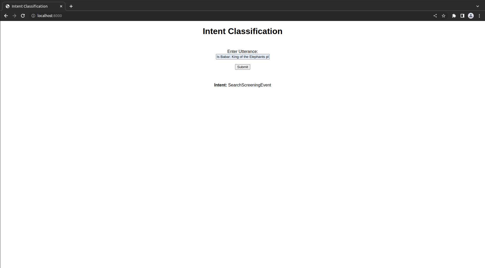

# llm-as-service
This repository contains a simple RoBERTa language model, utilized for intent detection on SNIPS dataset.
The RoBERTa LLM is firstly finetuned on text classification task on SNIPS dataset.
Then the finetuned model was wrapped under a simple FastAPI endpoint.

You can also access the finetuning process through this Google Colab link:
https://colab.research.google.com/drive/1MYdmEn2MtD_pFrhbANLyD9uJ35521RDR?usp=sharing
## How to use?
The directory tree of this project is as below:
```
$CoBiC
.
├── llm-as-service
|    ├── modules
|               ├── roberta-finetuned
|               |                   ├── config.json
|               |                   ├── merges.txt
|               |                   ├── special_tokens_map.json    
|               |                   ├── tokenizer_config.json
|               |                   ├── tokenizer.json
|               |                   └── vocab.json
|               ├── roberta-finetuned
|               |                   └── index.html
|               ├── app.py
|               ├── classifier.py
|               ├── Dockerfile
|               ├── requirements.txt
|               ├── test_app.py
```
First, clone the repository. Then change your directory to 'llm-as-service'. Run the following command:
```
~/llm-as-service:$sudo docker-compose up --build
```
This will start the process of building the project on your system.
If installation and unit tests passed successfully, the FastAPI endpoint will be ready to receive your requests on port 8000.
You can interact with the endpoint either using the simple UI by going to 'localhost:8000' or using curl in terminal.
Here is an example to interact with the endpoint using curl:
```
curl -X POST http://localhost:8000/intent_detection -d '{"utterance": "Is Babar: King of the Elephants playing"}' -H "Content-Type: application/json"
```
If the building process has finished successfully, you should receive this response:
```
{"intent":"SearchScreeningEvent"}
```
This means that the intent of 'Is Babar: King of the Elephants playing' is 'SearchScreeningEvent'.
Here is also an example of working with the UI:


Some samples to use:
```
intent: PlayMusic
utterance:
- Play The Happy Blues by Ronnie Wood
- play a john maher track

intent: RateBook
utterance:
- rate this album four out of 6 stars
- Rate the current series four stars

intent: SearchCreativeWork
utterance:
- Wish to find the movie the Heart Beat
- Looking for a creative work called Plant Ecology

intent: GetWeather
utterance:
- What will the weather be faraway from here
- What's the weather going to be in UT

intent: BookRestaurant
utterance:
- Book a reservation for my babies and I
- Book me a reservation for the best bistro

intent: AddToPlaylist
utterance:
- I'd like to have this track onto my Classical Relaxations playlist
- Add Recalled to Life to This Is Alejandro Fernández

intent: SearchScreeningEvent
utterance:
- I need a list of Speakeasy Theaters movie times
- I want to see Shattered Image
```

* Note: The finetuned object of RoBERTa was not possible to be upploaded because of file volume limitations on github. The finetuned version will be downloaded automatically from (https://drive.google.com/file/d/1-lFF3vM-ZiUlhLl6ccc-6ZmcgnO3OdJR/view?usp=share_link) after running `docker-compose up`.